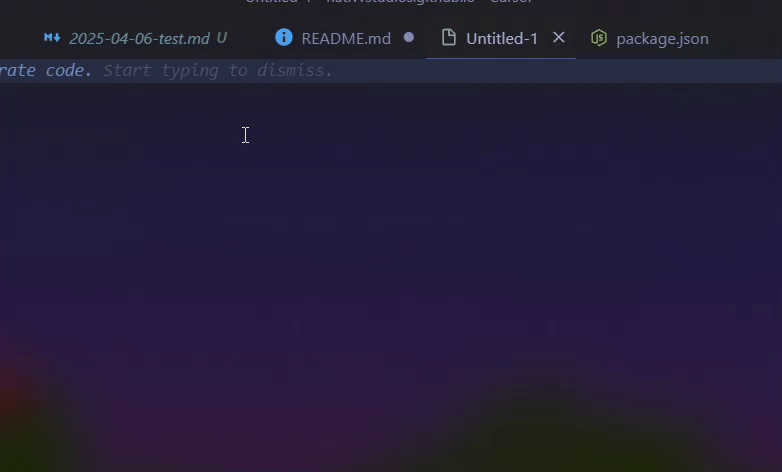

# Jekyll Post Creator for VS Code

A Visual Studio Code extension that simplifies creating new Jekyll blog posts with proper frontmatter formatting and system-accurate timestamps using a dedicated panel.


*(Note: Demo GIF shows the previous command-based workflow. The current version uses a Webview panel.)*

## Features

- Create new Jekyll posts via an **interactive Webview panel**.
- Enter post title, categories, tags, and select layout easily within the panel.
- **Add custom front matter options** (key-value pairs) directly in the UI.
- **Responsive design** that adapts to panel size and uses **VS Code theme colors**.
- Webview UI is built with separate **HTML, CSS, and JavaScript** files for easier maintenance.
- Automatically formats the filename using the date and post title: `YYYY-MM-DD-title-slug.md`.
- Generates frontmatter with:
  - Title (from your input)
  - Layout (post, page, or custom)
  - Categories (in array format: `["category1","category2"]`)
  - Tags (in array format: `["tag1","tag2"]`)
  - Date (using local system time with timezone offset)
  - Any **custom options** you added.
- Automatically finds or creates the `_posts` directory.
- Opens the new post file for immediate editing after creation.

## Installation

**Note: Currently, building from source is the only supported installation method.**

### Manual Installation from .vsix file

After building from source:
1. In VS Code, go to Extensions view (Ctrl+Shift+X)
2. Click the "..." menu in the top-right of the Extensions view
3. Select "Install from VSIX..." and choose the .vsix file you built

## Building From Source (Current Installation Method)

1. Clone the repository:
   ```bash
   git clone https://github.com/yourusername/jekyll-post-creator.git
   cd jekyll-post-creator
   ```

2. Install dependencies:
   ```bash
   npm install
   ```

3. Package the extension:
   ```bash
   npm run package
   # or directly use vsce
   npx vsce package
   ```

4. The packaged extension (.vsix file) will be created in the project root

## How to Use

### Command Palette

1. Press `Ctrl+Shift+P` (or `Cmd+Shift+P` on macOS) to open the command palette.
2. Type `Jekyll: Create New Post` or `Jekyll: Show Creator Window` and select either command.
3. A **"Jekyll Post Creator" panel** will open in your editor pane.
4. Fill in the details in the panel:
   - **Title:** The main title of your post.
   - **Categories:** Space-separated words (e.g., `tech tutorial`).
   - **Tags:** Space-separated words (e.g., `vscode extension javascript`).
   - **Layout:** Select from the dropdown (`post`, `page`, `custom`).
   - **Additional Options:** Click the "+ Add Option" button to add custom front matter fields (e.g., key: `comments`, value: `true`). Use the "-" button to remove options.
5. Click the "Create Post" button.

### ~~Context Menu~~

*(Note: The context menu entry currently triggers the command palette flow, which opens the panel.)*

## Output Example

For a post titled "My First Jekyll Post" with categories "life recap", tags "jekyll markdown", and a custom option `published: true`, the extension creates:

Filename: `2025-04-05-my-first-jekyll-post.md` (date will match current system date)

Content:
```markdown
---
layout: post
title: "My First Jekyll Post"
date: 2025-04-05 15:30:45 -0400
categories: ["life","recap"]
tags: ["jekyll","markdown"]
published: true
---

<!-- Your content here -->
```

## Directory Handling

The extension will:
1. Look for an existing `_posts` directory in your workspace
2. If not found, it will either:
   - Create the directory for you
   - Let you select a different location
   - Cancel the operation

## Requirements

- Visual Studio Code 1.60.0 or higher

## Extension Settings

This extension doesn't add any VS Code settings currently.

## Development

### Project Structure

```
jekyll-post-creator/
├── .vscode/           # VS Code settings
│   └── launch.json    # Debug configuration
├── images/            # Screenshots and demo GIFs
├── webview/           # Files for the Webview UI
│   ├── view.html      # HTML structure
│   ├── style.css      # CSS rules
│   └── main.js        # Client-side JavaScript
├── .eslintrc.json     # ESLint configuration
├── .gitignore         # Git ignore file
├── extension.js       # Main extension code
├── package.json       # Extension manifest
├── README.md          # This file
└── CHANGELOG.md       # Version changes
```

### Running in Development Mode

1. Open the project in VS Code
2. Press F5 to start debugging
3. A new VS Code window will open with the extension loaded
4. Test the extension in the new window

### Debugging Workflow

- **Backend Changes (`extension.js`):** To see changes in the main extension logic, you need to restart the debugger (Press `Ctrl+Shift+F5` or use the Restart button on the Debug toolbar) after saving your changes.
- **Frontend Changes (`webview/view.html`, `webview/style.css`, `webview/main.js`):** While the debugger (F5) is running and your webview panel is open in the Extension Development Host window:
    1. Save your changes in the webview file(s).
    2. Switch to the Extension Development Host window.
    3. Open the Command Palette (`Ctrl+Shift+P`).
    4. Run the command `Developer: Reload Webviews`.
    5. The panel will refresh instantly with your UI changes. (Alternatively, use `Developer: Open Webview Developer Tools` and refresh from there.)

This allows for a much faster iteration cycle when designing the webview UI compared to restarting the full debugger.

## Contributing

Contributions are welcome! Please feel free to submit a Pull Request.

1. Fork the repository
2. Create your feature branch (`git checkout -b feature/amazing-feature`)
3. Commit your changes (`git commit -m 'Add some amazing feature'`)
4. Push to the branch (`git push origin feature/amazing-feature`)
5. Open a Pull Request

# Future structure might include:
# ├── media/
# │   ├── main.css     # Styles for the webview
# │   └── main.js      # Script for the webview
