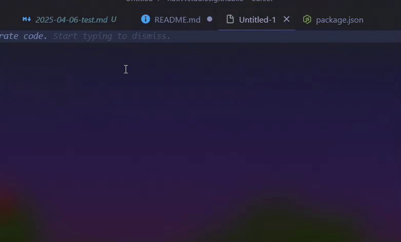

# Jekyll Post Creator for VS Code

A Visual Studio Code extension that simplifies creating new Jekyll blog posts with proper frontmatter formatting and system-accurate timestamps.



## Features

- Create new Jekyll posts with a convenient command
- Automatically formats the filename using the date and post title: `YYYY-MM-DD-title-slug.md`
- Generates frontmatter with:
  - Title (from your input)
  - Layout (post, page, or custom - selectable from dropdown)
  - Categories (in array format: `["category1","category2"]`)
  - Tags (in array format: `["tag1","tag2"]`)
  - Date (using local system time with timezone offset)
- Automatically finds or creates the `_posts` directory
- Opens the new post file for immediate editing

## Installation

**Note: Currently, building from source is the only supported installation method.**

### Manual Installation from .vsix file

After building from source:
1. In VS Code, go to Extensions view (Ctrl+Shift+X)
2. Click the "..." menu in the top-right of the Extensions view
3. Select "Install from VSIX..." and choose the .vsix file you built

## Building From Source (Current Installation Method)

1. Clone the repository:
   ```bash
   git clone https://github.com/yourusername/jekyll-post-creator.git
   cd jekyll-post-creator
   ```

2. Install dependencies:
   ```bash
   npm install
   ```

3. Package the extension:
   ```bash
   npm run package
   # or directly use vsce
   npx vsce package
   ```

4. The packaged extension (.vsix file) will be created in the project root

## How to Use

### Command Palette

1. Press `Ctrl+Shift+P` (or `Cmd+Shift+P` on macOS) to open the command palette
2. Type `Jekyll: Create New Post` and select it
3. Enter the requested information:
   - Post title
   - Categories (space separated, will be formatted as array)
   - Tags (space separated, will be formatted as array)
   - Layout type (from dropdown)

### Context Menu

1. Right-click in the Explorer view
2. Select "Jekyll: Create New Post" from the context menu
3. Follow the prompts as described above

## Output Example

For a post titled "My First Jekyll Post" with categories "life recap" and tags "jekyll markdown", the extension creates:

Filename: `2025-04-05-my-first-jekyll-post.md` (date will match current system date)

Content:
```markdown
---
layout: post
title: "My First Jekyll Post"
date: 2025-04-05 15:30:45 -0400
categories: ["life","recap"]
tags: ["jekyll","markdown"]
---

<!-- Your content here -->
```

## Directory Handling

The extension will:
1. Look for an existing `_posts` directory in your workspace
2. If not found, it will either:
   - Create the directory for you
   - Let you select a different location
   - Cancel the operation

## Requirements

- Visual Studio Code 1.60.0 or higher

## Extension Settings

This extension doesn't add any VS Code settings currently.

## Development

### Project Structure

```
jekyll-post-creator/
├── .vscode/           # VS Code settings
│   └── launch.json    # Debug configuration
├── images/            # Screenshots and demo GIFs
├── .eslintrc.json     # ESLint configuration
├── .gitignore         # Git ignore file
├── extension.js       # Main extension code
├── package.json       # Extension manifest
├── README.md          # This file
└── CHANGELOG.md       # Version changes
```

### Running in Development Mode

1. Open the project in VS Code
2. Press F5 to start debugging
3. A new VS Code window will open with the extension loaded
4. Test the extension in the new window

## Contributing

Contributions are welcome! Please feel free to submit a Pull Request.

1. Fork the repository
2. Create your feature branch (`git checkout -b feature/amazing-feature`)
3. Commit your changes (`git commit -m 'Add some amazing feature'`)
4. Push to the branch (`git push origin feature/amazing-feature`)
5. Open a Pull Request
